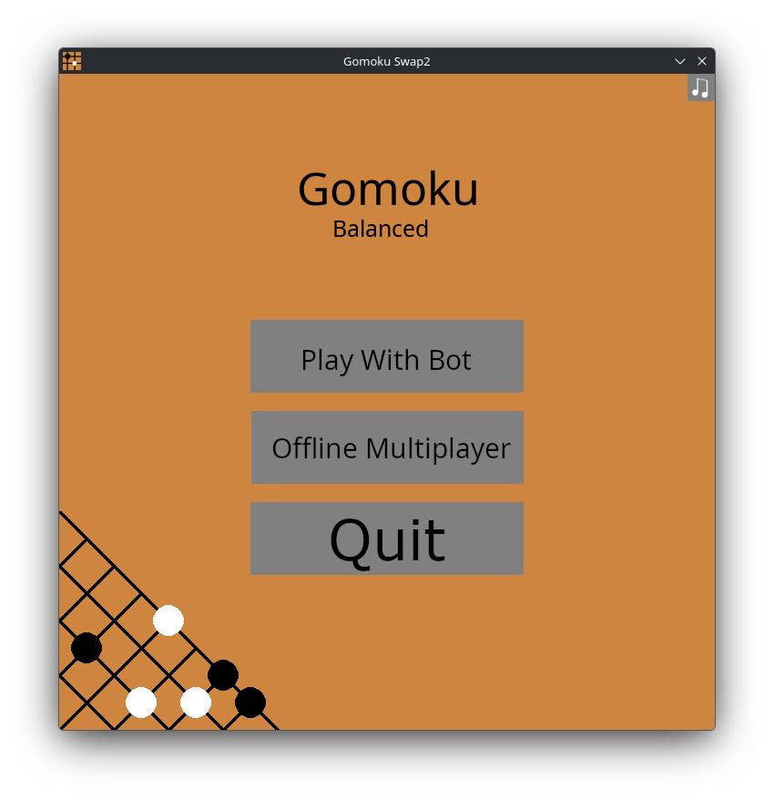

# Gomoku (Balanced)
An East Asian board game simular to tic-tac-toe, except it's played on a 15x15 board, and you need to get 5 in a row to win.

[Get the game here](https://ethancubes.itch.io/gomoku-balanced)
## Quickstart
Download the game files from Itch.io according to your operating system, and run them.
This game was built (primarily) on Linux and the build files were originally for Linux and were converted to .exe and .app files by GitHub Actions.
### MacOS users
1. You'll need to have admin permissions to run this program.
2. Double-click the executable file, and a pop-up will pop up that says that Apple could not confirm the app isn't malware (it isn't, you can check the files). Don't delete the file yet, since it'd be slightly inconvenient.
3. To bypass this, you have to go to Settings/Privacy and Security.
4. Scroll down until you get to the thing that says that the application was blocked from running. Click allow anyway.
5. A popup will ask for conformation that you want to launch the app. Make sure to select the right option.
6. A popup will ask for admin permissions. Enter admin password or use admin touch id.
7. The app should launch in the terminal, and the pygame window should open.

## Features
- Randomized starting position for balancing.
- A main menu with 3 clickable buttons that each do their own thing.
- A 15x15 Go board that Gomoku is played on.
- A local multiplayer mode that allows for you to play against your (IRL) friends (or yourself if you have no friends)
- A bot that is somewhat intelligent and actively responds to your threats and creates its own threats.
- Background music that is somewhat annoying. Can be turned off though, and it stays that way.

## How to run code locally
Requires Python 3.12.13 and Pygame 2.6.1 (Note that the project will still technically work inside the newer Python versions, but on 3.14.6 specifically the music is broken). You will probably have to install them inside a venv since this program uses an older version of Python as aforementioned.
Clone the project from GitHub, then run main.py.

## How it works
Pygame creates a window and draws lines to form the game board. Circles are drawn to represent stones according to the board positions list. Clicking on a spot on the board uses math to find which spot the stone should be placed at, and together with the current turn changes the list of board positions to include the placed stone.

To figure out when the game is over, an algorithm scans the board every frame to see if there is any five-in-a-rows, and returns their position if yes in order to draw a line highlighting the winning pattern.

### For the bot, well.........

There are two reasons why the bot may make a move. 1 is that the bot needs to defend, and 2 is that the bot needs to attack. Mostly defense is prioritied above offense, except when the offense creates a threat that outweighs the current threat needing to be defended.

To find places to attack or defend, a function scans in all 8 directions for all 225 possible spots (1800 iterations in total) and compares the iterations against a specified pattern, for example [0,1,1,1,0] is an open 3 and [0,1,1,1,1,0] is impending doom (open four). If it finds a position, it will add it to a list of positions, which is returned to the "analyze" function to be analyzed. The "analyze" function eventually returns a set of coordinates that the bot will place a stone at, in around the same way that a user might place a stone.

# Help/FAQ
### Why is the board starting in such a weird position?
This is done for balancing, as normally black plays first and has a close to 100% chance of winning.

### What is "Offline multiplayer"?
Offline multiplayer is when you play against someone (or yourself) in real life.

### Why is the bot so strong?
It's really not that strong and even someone with intermediate skill can beat it quite consistently. It gets easier with practice.

## Credits
- [Pygame official documentation](https://www.pygame.org/docs/) was helpful in getting the project started.
- [Pytutorial](https://pytutorial.com/python-pygame-draw-line-guide/) helped with drawing lines.
- [GeeksForGeeks](https://www.geeksforgeeks.org/python/pygame-drawing-objects-and-shapes/) also helped with drawing lines.
- [w3Schools](https://w3schools.com) is always a great help no matter what I am making.  
- "Elevator Music", "Amazing Plan", "Scheming Weasel Faster" are all by Kevin MacLeod (https://incompetech.com), licensed under CC by http://creativecommons.org/licenses/by/4.0/
- [DeepSeek](https://deepseek.com) AI was used for debugging and for some emotional support when I didn't know what to do or came close to crashing out.
- [CommonLuke's Video on making a chess engine](https://www.youtube.com/watch?v=UqCXwP1F-ho) was a major inspiration in me starting this project. The video is also really entertaining, I've watched it like 3 times now.